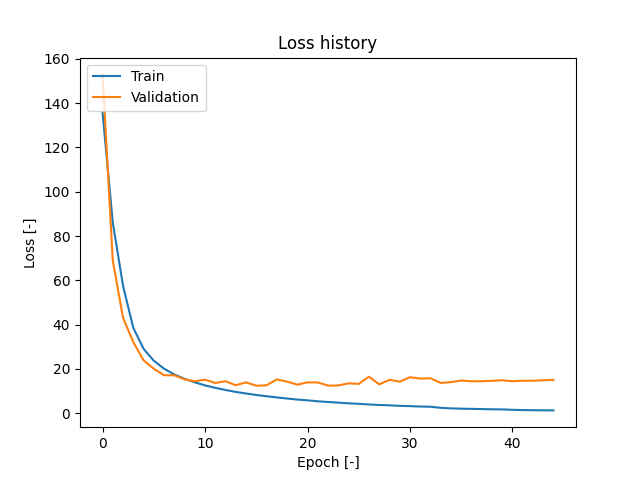
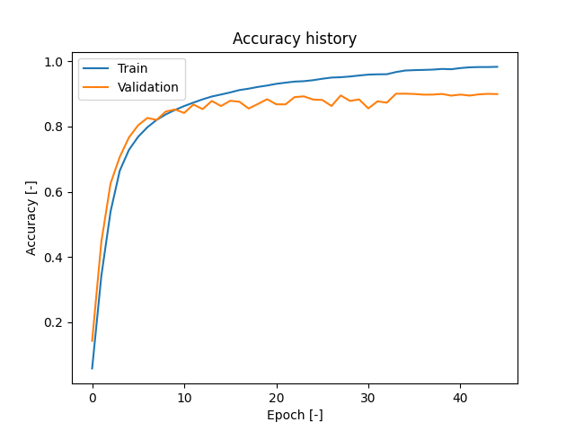

# OcrBenthamDataset

## Short description
OCR model trained using <a href="https://zenodo.org/records/44519" target="_blank">Bentham Dataset</a>. As stated in the description: <br>
"The Bentham collection consists of a set of images of a collection of works on law and moral philosophy written by the philosopher Jeremy Bentham.".

It's made of 4 components:
 - **ocr_predictor**
 - **ocr_api**
 - **ocr_webapp**
 - **yolo_detector** - detecting text lines
 - **document_ocr** - full solution, combined Yolo with OCR

[](https://www.youtube.com/watch?v=ao2Zn7V1XVk)

## Setup
  - ```pip install -r requirements.txt```

## Packages
```
fastapi==0.115.5
filterpy==1.4.5
Flask==3.1.0
flask_wtf==1.2.2
matplotlib==3.7.1
numpy==1.26.0
opencv_contrib_python==4.10.0.84
opencv_python==4.9.0.80
opencv_python_headless==4.9.0.80
pandas==2.0.2
Pillow==10.3.0
pydantic==2.12.5
python-dotenv==1.0.1
Requests==2.32.3
sahi==0.11.22
scikit_learn==1.7.2
tensorflow==2.17.0
tensorflow_intel==2.17.0
tqdm==4.65.0
ultralytics==8.3.89
uvicorn==0.32.0
WTForms==3.2.1
```

## Project Structure
```
│   config.py
│   custom_decorators.py
│   custom_logger.py
│   document_ocr.py
│   README.md
│   requirements.txt
│   tools.py
│   ocr_predictor.py
│   yolo_detector.py
├───DatasetPrepTools
├───logs
├───ocr_api
│   └───__pycache__
├───ocr_models
│   ├───model3
│   └───model4
├───ocr_tools
│   └───logs
├───ocr_webapp
│   ├───static
│   │   ├───images
│   │   ├───styles
│   │   └───temp_uploads
│   ├───templates
│   └───__pycache__
├───TestData
├───train_data
│   ├───images
│   │   ├───train
│   │   └───val
│   └───labels
│       ├───train
│       └───val
├───yolo_models
└───__pycache__
```

## OCR Model architecture
### 1. Input Layer:
Accepts grayscale images of a defined height and width (800x128).

### 2. Convolutional Blocks (CNN):

Block 1 and 2: Each block performs convolution with increasing filter counts (32 then 64), followed by batch normalization, ReLU activation, and max pooling. This reduces spatial dimensions while capturing basic and then more complex features.
Block 3 and 4: Applies additional convolution with 64, 128 filters, batch normalization, and ReLU activation without pooling, refining the feature maps further.

### 3. Permutation and Reshaping:
The output tensor from the CNN layers is rearranged by swapping the height and width dimensions. It is then reshaped so that the height and filter dimensions are merged into a single feature dimension, creating a sequential representation for subsequent processing.

### 4. Recurrent Layers (RNN):
Multiple bidirectional GRU layers process the sequential data. They capture temporal dependencies in the extracted features, which is critical for sequence tasks like OCR.

### 5.Dense Layers and Output:
A fully connected dense layer with ReLU activation (and dropout for regularization) further processes the features. The final dense layer uses a softmax activation to produce character probability distributions. An extra output unit is included to handle the blank label required by the CTC loss.

### 6. Compilation:
The model is compiled with the Adam optimizer and a custom CTC loss function, making it well-suited for OCR tasks where alignment between predictions and actual sequences can vary.

### 7. Build parameters
 - LEARNING_RATE = 0.0001
 - IMAGE_WIDTH = 800
 - IMAGE_HEIGHT = 128
 - RNN_LAYERS = 3
 - RNN_UNITS = 768
 - WARMUP = False
```python

def build_model(
    char_to_num: keras.layers.StringLookup,
    img_width: int = IMAGE_WIDTH,
    img_height: int = IMAGE_HEIGHT,
    rnn_layers: int = RNN_LAYERS,
    rnn_units: int = RNN_UNITS,
    learning_rate: float = LEARNING_RATE,
    warmup: bool = WARMUP
) -> keras.Model:

    img_input = keras.Input(shape=(img_height, img_width, 1), name="image")

    # CNN 1
    x = keras.layers.Conv2D(32, (3, 3), padding="same", use_bias=False)(img_input)
    x = keras.layers.BatchNormalization()(x)
    x = keras.layers.ReLU()(x)
    x = keras.layers.MaxPooling2D((2, 2), strides=2)(x)

    # CNN 2
    x = keras.layers.Conv2D(64, (3, 3), padding="same", use_bias=False)(x)
    x = keras.layers.BatchNormalization()(x)
    x = keras.layers.ReLU()(x)
    x = keras.layers.MaxPooling2D((2, 2), strides=2)(x)

    # CNN 3
    x = keras.layers.Conv2D(64, (3, 3), padding="same", use_bias=False)(x)
    x = keras.layers.BatchNormalization()(x)
    x = keras.layers.ReLU()(x)
    # x = keras.layers.MaxPooling2D((2, 2), strides=2)(x)

    # CNN 4 (no pooling)
    x = keras.layers.Conv2D(128, (3, 3), padding="same", use_bias=False)(x)
    x = keras.layers.BatchNormalization()(x)
    x = keras.layers.ReLU()(x)

    # Axis swap (height and width) => (batch, H//8, W//8, 128)
    x = keras.layers.Permute((2, 1, 3), name="permute")(x)

    # Reshape: (batch, W//4, (H//4)*128)
    x = keras.layers.Reshape(
        (img_width // 4, (img_height // 4) * 128),  # the number of fitlers in the last cnn
        name="reshape"
    )(x)

    for i in range(rnn_layers):
        x = keras.layers.Bidirectional(
            keras.layers.GRU(rnn_units, return_sequences=True, dropout=0.4)
        )(x)
        if i < rnn_layers - 1:  # not after last layer
            x = keras.layers.Dropout(0.3)(x)

    x = keras.layers.Dense(rnn_units * 2, activation="relu", name="dense_1")(x)
    x = keras.layers.Dropout(0.3)(x)

    vocab_size = len(char_to_num.get_vocabulary())
    output = keras.layers.Dense(
        vocab_size + 1,
        activation="softmax",
        name="dense_2"
    )(x)

    model = keras.Model(inputs=img_input, outputs=output)
    if warmup:
        learning_rate_comp = WarmupSchedule(initial_lr=learning_rate, warmup_epochs=5)
    else:
        learning_rate_comp = learning_rate

    model.compile(
        optimizer=keras.optimizers.Adam(learning_rate=learning_rate_comp, clipnorm=5.0),
        loss=CTCLoss,
        metrics=[ctc_accuracy]
    )
    return model
```

### 8. CTC loss:
CTC loss, or **Connectionist Temporal Classification Loss**, is a loss function used primarily in sequence recognition tasks where the output length is not specified. It is particularly useful in speech recognition, image-to-text transcription (OCR) and other sequence processing model

 - **How does CTC Loss work?** <br>
Independence of input and output length: In many cases, the length of the input sequence differs from the length of the expected output sequence (e.g., the number of characters in a transcription). CTC is designed to handle this problem.

- **Inserting a “blank” symbol**: <br>
 CTC uses an additional blank symbol (meaning “no character”) to help deal with the situation when the model does not predict a new character in each input frame. Blank symbols allow the model to differentiate between adjacent characters and ignore redundant predictions.

- **Different matches (alignment)**: <br>
CTC calculates the probability of different possible matches between the input sequence and the output sequence. For example, for an input audio signal that corresponds to the output “HELLO,” the model can generate multiple combinations (e.g., “H_E_LL_O_” where “_” is a blank) that will be interpreted as correct transcriptions.

In sequential tasks like optical character recognition (OCR), the length of the input (e.g., the number of pixel columns or image segments) is variable, as is the length of the output (e.g., the number of characters in a transcription). CTCLoss is designed specifically to deal with this variability in length, allowing for different input to output matches and inserting blank symbols in the appropriate place.


```python
@register_keras_serializable(package="Custom")
def CTCLoss(y_true: TensorLike, y_pred: TensorLike, padding_token: int = PADDING_TOKEN) -> tf.Tensor:
    """
    y_true: (batch, max_len) with character indices and 99 as PAD (padding).
    y_pred: (batch, time_steps, vocab_size) - network output (logits or probabilities).
    """
    # Get batch size and number of time steps from shapes
    batch_size = tf.shape(y_true)[0]
    time_steps = tf.shape(y_pred)[1]

    # Calculate how many characters are not the padding token (actual sequence length per sample) - in other words count label len with no padding values
    label_length = tf.reduce_sum(
        tf.cast(tf.not_equal(y_true, padding_token), tf.int32),
        axis=1,       # sum along the character (sequence) axis
        keepdims=True # the result will then have shape (batch, 1)
    )

    # For the predictions y_pred, we assume each sample has input_length = time_steps
    input_length = time_steps * tf.ones((batch_size, 1), dtype=tf.int32)

    # ctc_batch_cost expects (y_true, y_pred, input_length, label_length)
    loss = keras.backend.ctc_batch_cost(
        y_true,       # true labels
        y_pred,       # predictions
        input_length, # number of time steps per sample
        label_length  # actual length of each label (no pads)
    )
    return loss


@register_keras_serializable(package="Custom")
def ctc_accuracy(y_true: TensorLike, y_pred: TensorLike, padding_token: int = PADDING_TOKEN) -> tf.Tensor:
    """
    y_true: (batch, max_len) with PAD=99
    y_pred: (batch, time_steps, vocab_size)
    """
    batch_size = tf.shape(y_pred)[0]
    time_steps = tf.shape(y_pred)[1]

    # The decoder requires the length of each input sequence
    # Here, we assume it's simply time_steps for all samples
    input_lengths = tf.fill([batch_size], time_steps)

    # Remove the padding from y_true and create a SparseTensor of actual labels
    y_true = tf.cast(y_true, tf.int64)
    indices = tf.where(tf.not_equal(y_true, padding_token))  # positions where value != 99
    values = tf.gather_nd(y_true, indices)                   # extract those values
    dense_shape = tf.cast(tf.shape(y_true), tf.int64)
    y_true_sparse = tf.SparseTensor(indices, values, dense_shape)

    # Greedy decoding of y_pred:
    # We transpose y_pred to shape (time_steps, batch, vocab_size),
    # because tf.nn.ctc_greedy_decoder expects it in this format.
    decoded, _ = tf.nn.ctc_greedy_decoder(
        tf.transpose(y_pred, [1, 0, 2]),
        input_lengths,
        merge_repeated=True
    )
    # Cast the decoded result to int64
    decoded_sparse = tf.cast(decoded[0], tf.int64)

    # Calculate accuracy via edit distance:
    # accuracy = 1 - average_edit_distance
    accuracy = 1 - tf.reduce_mean(
        tf.edit_distance(decoded_sparse, y_true_sparse, normalize=True)
    )
    return accuracy
```

### 9. Training
For taining use **bentham_ocr.ipynb**, in Colab/jupiter with access to GPU but free GPU might have not enought VRAM for 3 layers of 768 units LSTMs, so I recommend smaller model or upgrading to premium or other environment with better GPU.


Loss history


Loss value goes down to around 15 for validation dataset and is close to 1 for training dataset. For validation loss, after 10th epoch line starts to flatten with some up and down picks and finally after aound 32th epoch it flattens almost perfectly while train loss is keep on decresing since 10th epoch.

Accuracy history


Accuracy for validation dataset reaches 0.9 at it's peak and training accuacy is almost 1. Like in the loss history we can see that around 8-10th epoch validation accuracy is going up and down and after 32th epoch it flattens while train accuracy is raising and raising without any ups and downs.

These results show that model is quite successful and can be used for target tasks. There is still some space to improve it but it's good enough.

## Yolov11 Model

Yolov11 has been trained using pages from Bentham dataset - https://zenodo.org/records/44519/files/BenthamDatasetR0-Images.tbz. There is only one class `line` in classes.txt - this class was used to label each text line in the page. 


